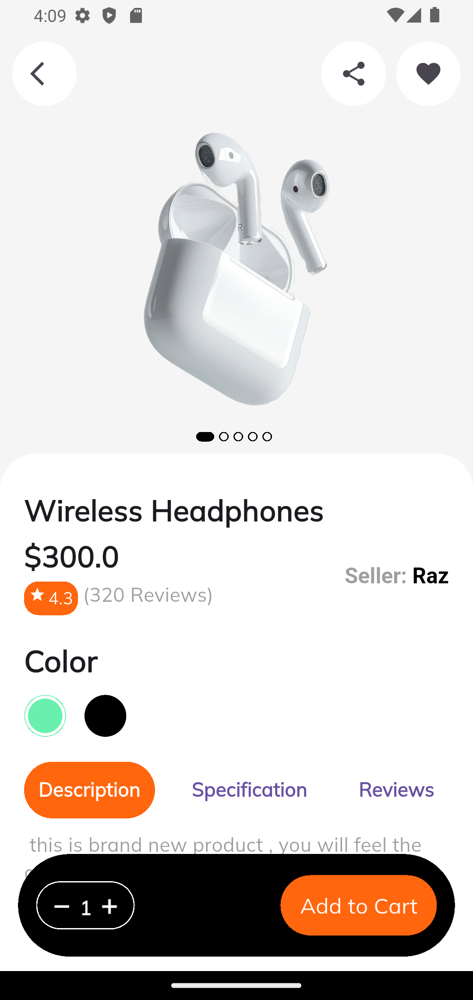
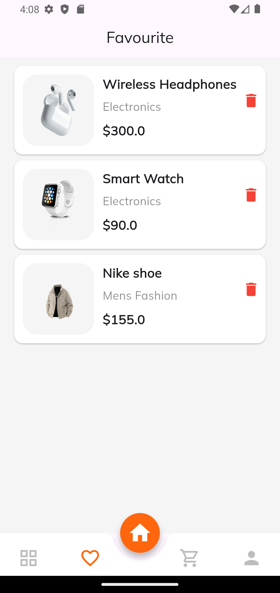
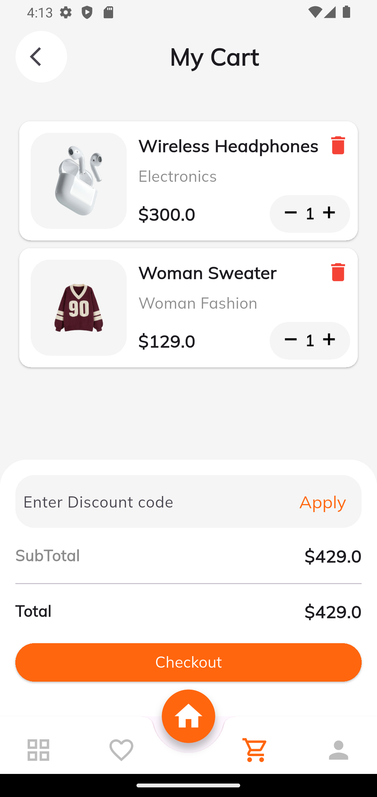
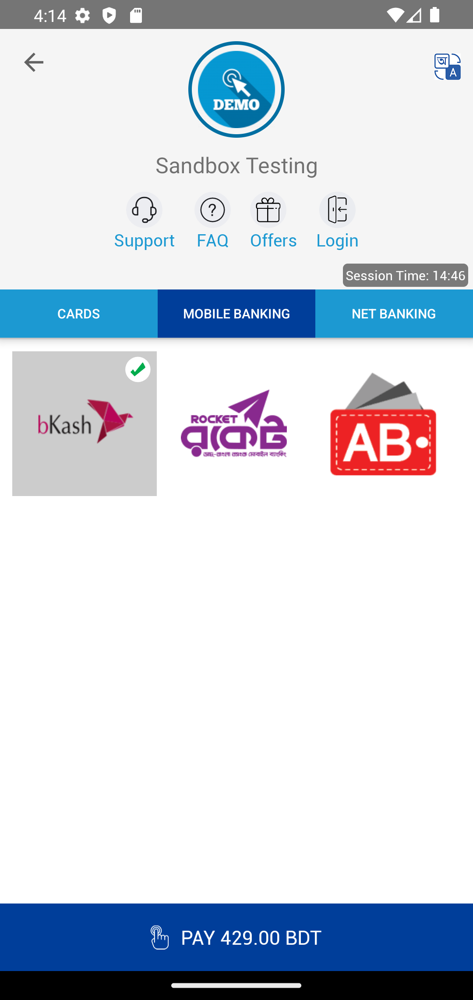

#  E-Commerce Flutter App

A modern Flutter e-commerce application built using **Provider State Management**.  
This app includes product browsing, favorites, cart management, product details, profile UI, and SSLCommerz payment integration.

---

##  Features

-  Home screen with categories & product slider
-  Product search UI
-  Add/Remove Favourite Products
-  Cart Management
-  Increase/Decrease Product Quantity
-  Product Details Screen
-  SSLCommerz Payment Integration
-  Beautiful Profile Screen
-  Clean UI with Provider State Management

---

## 🛠 Technologies Used

- Flutter
- Dart
- Provider
- SSLCommerz
- Google Fonts

---

##  Screenshots

### Home Screen


### Extended Home Screen


### Product Details Screen


### Wishlist Screen


### Cart Screen


### Payment Screen


### Profile Screen


---

##  Project Structure

```bash
lib/
│
├── app/
├── models/
├── provider/
├── screens/
│   ├── home/
│   ├── cart/
│   ├── favourite/
│   ├── profile/
│   ├── product_details/
│
└── main.dart
```

---

##  Getting Started

### Prerequisites

- Flutter SDK Installed
- Android Studio / VS Code
- Emulator or Physical Device

---

##  Installation

```bash
git clone <your-repository-link>

cd your_project_name

flutter pub get

flutter run
```

---

##  Dependencies

```yaml
dependencies:
  flutter:
    sdk: flutter

  provider:
  google_fonts:
  flutter_sslcommerz:
  uuid:
```

---

##  Payment Gateway

This project uses:

- SSLCommerz Sandbox Integration

---

##  Developer

### Abdul Aziz Patwary

- Flutter Developer
- Computer Science Graduate

---